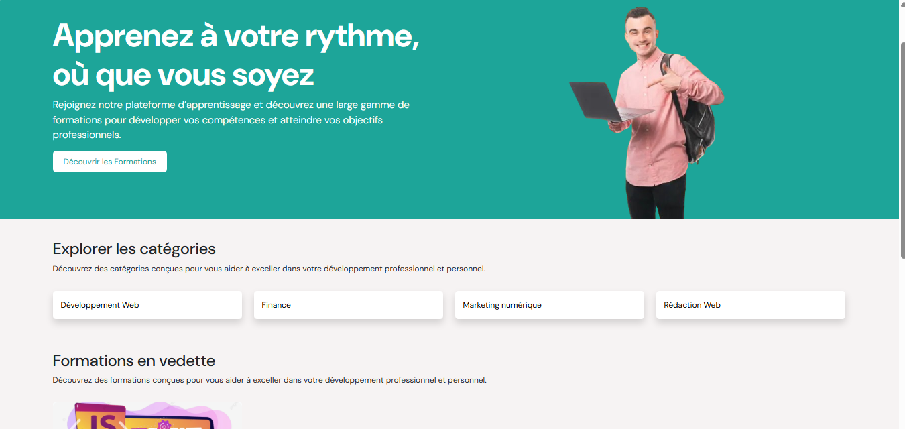

<div align="center">
  
  
  # Academix - Plateforme d'Apprentissage en Ligne Complète

[](https://opensource.org/licenses/MIT)
[](https://reactjs.org/)
[](https://vitejs.dev/)
[](https://getbootstrap.com/)
[](https://reactrouter.com/)
[](https://react-hook-form.com/)
[](https://laravel.com/)
[](https://www.php.net/)
[](https://www.mysql.com/)
[](https://laravel.com/docs/sanctum)
[](https://image.intervention.io/)
[](https://git-scm.com/)

_La plateforme d'apprentissage en ligne tout-en-un pour les apprenants et les formateurs_
_Créez, partagez et apprenez avec une expérience utilisateur exceptionnelle_

</div>

## 📋 Table des matières

- [Présentation](#-présentation)
- [Fonctionnalités](#-fonctionnalités)
- [Installation](#-installation)
- [Structure du Projet](#-structure-du-projet)
- [Technologies Utilisées](#-technologies-utilisées)
- [Contact](#-contact)

## 🌟 Présentation

Academix est une plateforme d'apprentissage en ligne complète qui permet aux formateurs de créer et de gérer des cours, et aux étudiants d'accéder à un contenu éducatif de qualité. Avec une interface intuitive et des fonctionnalités puissantes, Academix révolutionne l'expérience d'apprentissage en ligne.

## 🚀 Fonctionnalités

### Pour les Étudiants

- 🔍 Parcourir le catalogue de cours par catégories
- 🎓 S'inscrire à des cours
- 📱 Accéder aux leçons après inscription
- ⭐ Donner des avis et noter les cours
- 📊 Suivre sa progression dans les cours
- 🔍 Rechercher des cours par mot-clé
- 🏷️ Filtrer les cours par :
  - Catégorie (Développement Web, Finance, etc.)
  - Niveau (Débutant, Intermédiaire, Expert)
  - Langue (Français, Anglais, etc.)
  - Prix
  - Notes des utilisateurs
- 🔄 Réinitialiser les filtres de recherche
- 👤 Gérer son profil utilisateur
- 🔑 Changer son mot de passe

### Pour les Formateurs

#### Gestion des Cours

- 📝 Création et édition de cours
- 🏗️ Structure modulaire avec chapitres et leçons
- 🎨 Personnalisation de l'image de couverture
- 🏷️ Catégorisation des cours (Développement Web, Finance, etc.)
- 🌍 Définition de la langue et du niveau
- 💰 Gestion des prix (prix initial et prix de vente)
- 📝 Description détaillée avec éditeur riche
- 📋 Définition des prérequis et objectifs

#### Gestion du Contenu

- ➕ Ajout de leçons aux chapitres
- 🎥 Intégration de vidéos dans les leçons
- 📝 Éditeur de texte enrichi pour le contenu
- 🖼️ Téléchargement d'images et documents
- 🔄 Prévisualisation des leçons
- 🚀 Publication/retrait des cours

#### Tableau de Bord

- 📊 Statistiques des ventes
- 👥 Suivi des étudiants inscrits
- ⭐ Avis et évaluations des cours
- 📈 Performances des cours

#### Gestion du Compte

- 👤 Profil formateur
- 🔑 Changement de mot de passe
- 🏆 Badges et réalisations

## 🛠️ Installation


#### Serveur Web

- 🖥️ PHP 8.2+ avec les extensions :
  - BCMath, Ctype, cURL, DOM, Fileinfo, JSON, Mbstring, OpenSSL, PDO, Tokenizer, XML
- 🌐 Serveur web (Apache/Nginx) avec réécriture d'URL activée
- 📦 Composer 2.0+

#### Frontend

- ⚛️ Node.js 16+ et NPM 8+
- 🛠️ Vite (inclus dans les dépendances)

## 📂 Structure du Projet

Le projet est divisé en deux parties principales :

- [**Frontend**](./frontend/README.md) - Application React moderne avec Vite
- [**Backend**](./backend/README.md) - API RESTful Laravel

## 🚀 Premiers pas

### Prérequis

- Node.js 16+ et NPM (pour le frontend)
- PHP 8.2+ et Composer (pour le backend)
- MySQL 8.0+ ou MariaDB 10.3+
- GitCrédits avec privilèges de création de base de données

#### Frontend

- ⚛️ Node.js 16+ et NPM 8+
- 🛠️ Vite (inclus dans les dépendances)
{{ ... }}
   - Un compte administrateur est créé automatiquement :
     - Email: admin@academix.com
     - Mot de passe: password
   - Vous pouvez créer de nouveaux comptes via l'interface d'inscription

## 📂 Structure Détail

```
.
├── frontend/          # [Application React](./frontend/README.md)
├── backend/           # [API Laravel](./backend/README.md)
└── README.md          # Ce fichier
│   ├── public/       # Fichiers statiques
│   ├── src/          # Code source du frontend
│   │   ├── assets/   # Images, polices, etc.
│   │   ├── components/
│   │   ├── pages/
│   │   └── ...
│   └── ...
│
└── README.md         # Ce fichier
```

## 🛠 Technologies Utilisées

- **Frontend**:
  - React 19.1.1
  - React DOM 19.1.1
  - React Router DOM 7.9.1 (pour la navigation)
  - React Hook Form 7.63.0 (gestion des formulaires)
  - React Icons 5.5.0 (icônes)
  - React Hot Toast 2.6.0 (notifications)
  - React Player 3.3.3 (lecteur vidéo)
  - React Simple Star Rating 5.1.7 (système d'évaluation)
  - React Bootstrap 2.10.10 (composants UI)
  - Bootstrap 5.3.8 (framework CSS)
  - Jodit React 5.2.25 (éditeur de texte riche)
  - React FilePond 7.1.3 (téléchargement de fichiers)
  - @hello-pangea/dnd 18.0.1 (glisser-déposer)
  - SASS 1.93.0 (préprocesseur CSS)
  - Vite (bundler et outil de développement)
- **Backend**:
  - Laravel 12.x (framework PHP)
  - PHP 8.2.12
  - MySQL 8.0 (base de données)
  - Laravel Sanctum 4.0 (authentification API)
  - Intervention Image 3.11 (traitement d'images)
  - Laravel Tinker 2.10.1 (REPL pour Laravel)
  - Laravel Sail 1.41 (environnement de développement Docker)
  - Laravel Pint 1.24 (formateur de code PHP)
- **Outils** :
  - XAMPP (serveur web local avec Apache, MySQL, PHP)
  - Composer (gestion des dépendances PHP)
  - NPM (gestion des dépendances JavaScript)
  - Git (contrôle de version)
  - Postman (test des API)
  - Thunder Client (extension VS Code pour tester les API)

## 📄 Licence

Distribué sous la licence MIT.

## 📞 Contact

Email : kemognemalone@gmail.com

Lien du projet : [https://github.com/KemogneAlex/academix](https://github.com/KemogneAlex/academix)

---

<div align="center">
  <p>Développé avec ❤️ par Kemogné Alex</p>
  <p>© 2025 Academix - Tous droits réservés</p>
</div>
